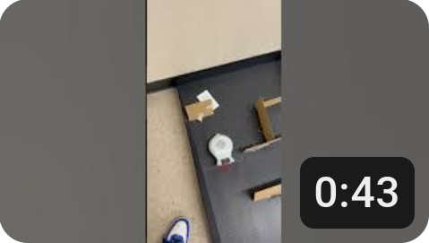

# Final Project: Finch Robot Challenges

## Essential Question
How can we apply object-oriented programming principles and Java concepts to create interactive, autonomous robot behaviors that solve real-world challenges?

## Project Overview
In this project-based learning experience, you will program a Finch 2.0 robot to perform one of three challenges:
1. Choreograph a dance routine (with movement, lights, and sound)
2. Create an artistic drawing using the robot's movements
3. Navigate a maze autonomously

Your program must demonstrate your understanding of Java programming concepts from APCSA and object-oriented design principles while creating an engaging robot behavior.

## Learning Objectives
- Apply Java programming concepts in a physical computing context
- Implement object-oriented design principles
- Develop problem-solving skills through algorithm development
- Create well-documented and maintainable code
- Practice technical communication through presentations and documentation

## Description of design choices
I decided to solve the maze by first making the bird move until it hit the first wall and turn around. Then I repeated the code to do it again. After that i just made the code follow the path step-by-step, turn-by-turn until I reached the end.

## Challenges faced and solutions
A challenge I faaced with the project was that it kept messing up even on turns I finished coding. So I had to go back and make precise movements instead of getDistance() movements (It was CB's idea). I was able to finish it just fine though.

## Future enhancements
Some enhancements I would make is that I would make it do the second path as well (the red one). Along with that, I would make sure that the code could've been made into a method and activated with one singular line of code.

## Videos or images of your robot in action (embedded or linked)
